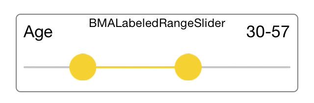
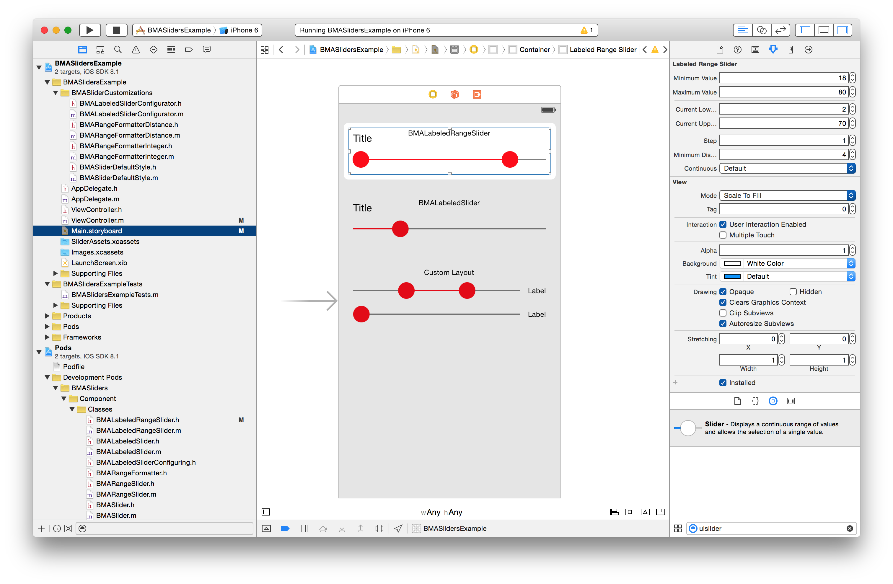

[](https://travis-ci.org/badoo/BMASliders)

# BMASliders
`BMASliders` is a set of reusable sliders. It includes two kind of sliders, one with customizable ranges -`BMARangeSlider`- and a simpler one -`BMASlider`- along with its labeled counterparts -`BMALabeledRangeSlider` and `BMALabeledSlider`

<div align="center">

</div>

## Features
- Live rendering in Interface Builder
- Configurable minimum distance between handlers
- Ability to allow only discretized values
- Overflow signal
- Configurable appearance

## How to use
###BMALabeledRangeSlider
`BMALabeledRangeSlider` provides a range slider with a title and a detail of the selected range. You can configure many of its properties by using *Attributes inspector* in *Interface Builder*. Alternatively, you can initialize in code as follows:

```objectivec
self.labeledRangeSlider.minimumValue = 0.;
self.labeledRangeSlider.maximumValue = 130.;
self.labeledRangeSlider.currentLowerValue = 30.;
self.labeledRangeSlider.currentUpperValue = 70.;
self.labeledRangeSlider.step = 1.;
self.labeledRangeSlider.minimumDistance = 4.;  // between handlers
self.labeledRangeSlider.style = [[BMASliderLiveRenderingStyle alloc] init];
self.labeledRangeSlider.title = [[NSAttributedString alloc] initWithString:@"My title"];
self.labeledRangeSlider.rangeFormatter = self.myRangeFormatter;
[self.labeledRangeSlider addTarget:self action:@selector(valueChanged) forControlEvents:UIControlEventValueChanged];
```

Everything should be self-explanatory but `rangeFormatter` and `style`. For `rangeFormatter` you must provide an object conforming to the `BMARangeFormatter` protocol:
```objectivec
@protocol BMARangeFormatter <NSObject>
@property (nonatomic) BOOL hasLowerValue;
@property (nonatomic) CGFloat lowerValue;
@property (nonatomic) CGFloat upperValue;
@property (nonatomic, getter=isOverflow) BOOL overflow;

- (NSAttributedString *)formattedString;
@end
```

When the selected range changes, `BMALabeledRangeSlider` will set properties `hasLowerValue`, `lowerValue`, `upperValue` and `overflow` to the `rangeFormatter` instance and will ask it for the string representation of the range by calling `formattedString`.

For the `style` property, you must supply an instance that returns the images for the handlers and the line backgrounds. `BMASliderLiveRenderingStyle` will be used by default in case you don't provide your own style.
```objectivec
@protocol BMASliderStyling <NSObject>
- (UIImage *)unselectedLineImage;
- (UIImage *)selectedLineImage;
- (UIImage *)handlerImage;
@end
```

For convenience, `BMASliders` support the UIAppearance protocol so you can easily style all the sliders in your app:
```objectivec
[BMARangeSlider appearance].style = [[BMASliderDefaultStyle alloc] init];
[BMASlider appearance].style = [[BMASliderDefaultStyle alloc] init];
```

###BMALabeledSlider
`BMALabeledRangeSlider` provides a range slider with a title and a detail of the selected range. It works pretty much the same as `BMALabeledRangeSlider`, but it's got just a `currentValue`.

```objectivec
self.labeledSlider.minimumValue = 0.;
self.labeledSlider.maximumValue = 130.;
self.labeledSlider.currentValue = 60.;
self.labeledSlider.style = [[BMASliderDefaultStyle alloc] init];
self.labeledSlider.title = [[NSAttributedString alloc] initWithString:@"My title"];
self.labeledSlider.rangeFormatter = self.myRangeFormatter;
[self.labeledSlider addTarget:self action:@selector(valueChanged) forControlEvents:UIControlEventValueChanged];
```

Note that `rangeFormatter` must again conform to `BMARangeFormatter` protocol. In this case however, the slider will set `hasLowerValue` to `false` and `currentValue` will be assigned to the `upperValue` property.

###BMARangeSlider and BMASlider
These are the non-labeled counterparts of `BMALabeledRangeSlider` and `BMALabeledSlider`. They don't have any `title` or `rangeFormatter` so they are easier to configure and can be used to render your custom layouts.

## Live rendering
`BMASliders` takes advantage of `IBInspectable` and `IBDesignable` directives that allow you to see how the component renders in *Interface Builder* and change the slider's attributes by using the *Attributes inspector*.


## How to install
### Using CocoaPods

1. Make sure `use_frameworks!` is added to your `Podfile`. Live rendering with XIB-based views requires `use_frameworks!` to work, which is available from CocoaPods 0.36. If you don't add `use_frameworks!` in your `Podfile` live rendering won't work and you'll get some nasty complains in Interface Builder. However, everything should work fine at run time.

2. Include the following line in your `Podfile`:
    ```
    pod 'BMASliders', '~> 1.0.0' 
    ```
If you like to live on the bleeding edge, you can use the `master` branch with:
    ```
    pod 'BMASliders', :git => 'https://github.com/badoo/BMASliders'
    ```
3. Run `pod install`

### Manually

1. Clone, add as a submodule or [download.](https://github.com/badoo/BMASliders/archive/master.zip)
2. Add all the files under `Component` to your project.
3. Make sure your project is configured to use ARC.

## License
Source code is distributed under MIT license.
